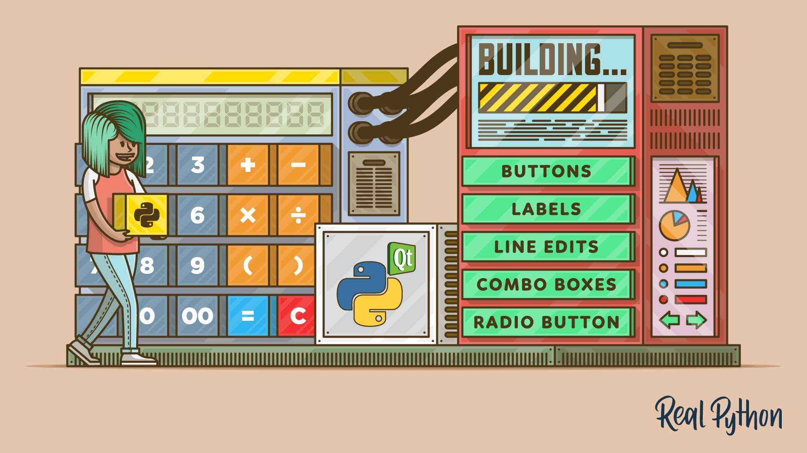
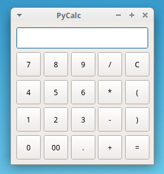
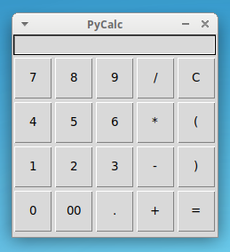
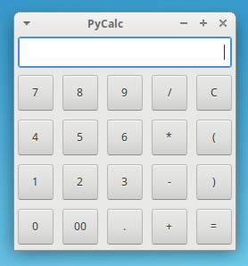

# PyCalc

PyCalc is a sample calculator implemented using Python 3. The GUI is built using [PyQt5](https://www.riverbankcomputing.com/static/Docs/PyQt5/introduction.html), [Tkinter](https://docs.python.org/3/library/tkinter.html), [PySide2](https://wiki.qt.io/Qt_for_Python), and [wxPython](https://realpython.com/python-gui-with-wxpython/) to show the flexibility of the Model-View-Controller (MVC) pattern.

PyCalc implements only the most basic math operations, that is:

- division
- multiplication
- addition
- subtraction

PyCalc is intended to be a demonstrative example of how you can implement a Python GUI applications using the most popular libraries for GUI design that are available today.

PyCalc is a sample project that extends the example I used in my [Real Python](https://realpython.com/) tutorial: [Python and PyQt: Building a GUI Desktop Calculator](https://realpython.com/python-pyqt-gui-calculator/).



## PyCalc's GUI

Here are some screenshots of the different GUIs of PyCalc.

### PyQt5 GUI



### Tkinter GUI



### PySide2 GUI


### wxPython GUI



## Requirements

For PyCalc to work, you need to have a proper installation of [Python](https://www.python.org) >= 3.6. Since PyCalc depends on PyQt5, Tkinter, PySide2, and wxPython to work, you can use a virtual environment to test PyCalc out. To do that, you can run the following commands:

```sh
$ python3 -m venv pycalc
$ source pycalc/bin/activate
$ pip install pyqt5
$ pip install pyside2
$ pip install wxpython
```

After these steps are done, you can run and test PyCalc as described in the next section.

## How to Run PyCalc

To run PyCalc from your system's command-line and try it out, you can execute the following command:

```sh
$ git clone https://github.com/lpozo/python-calculator.git
$ cd python-calculator
$ python3 main.py
```

After running these commands, you'll see PyCalc's GUI running on your screen. If you close the application and reopen it again, then you'll see that the interface changes to another framework.

## How to Use PyCalc

To use PyCalc, you just need to enter a valid math expression using your mouse and then press `Enter` or click on the `=` sign:


## About the Author

Hi, my name is Leodanis Pozo Ramos. I'm a **Self-Taught Python Developer, and [author](https://realpython.com/team/lpozoramos/)**. If you need more information about me, and my work, then you can take a look at my [personal page](https://lpozo.github.com/).

## License

PyCalc is released under the [MIT License](https://opensource.org/licenses/MIT).
