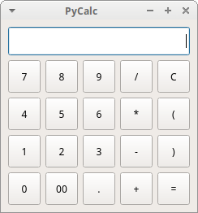
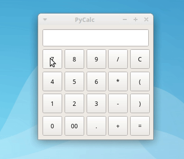

# PyCalc

PyCalc is a sample calculator implemented using Python 3. The GUI is built using [PyQt5](https://www.riverbankcomputing.com/static/Docs/PyQt5/introduction.html), [Tkinter](), [PySide2](), and [wxPython]() to show the flexibility of the Model-View-Controller (MVC) pattern.

PyCalc implements only the most basic math operations, that is:

- division
- multiplication
- addition
- subtraction

PyCalc is intended to be a demonstrative example on how you can implement a Python GUI applications using the most popular libraries for GUI design that are available today.

## Screenshot

### PyQt5 GUI



### Tkinter GUI


## Requirements

For PyCalc to work, you need to have a proper installation of [Python](https://www.python.org) >= 3.6. Since PyCalc depends on PyQt5, Tkinter, PySide2, and wxPython to work, you can use a virtual environment to test PyCalc out. To do that, you can run the following commands:

```console
$ python3 -m venv pycalc
$ source pycalc/bin/activate
$ pip install pyqt5
$ pip install pyside2
$ pip install wxpython
$ pip install tkinter
```

After this steps are finished, you can run and test PyCalc as described in the next section.

## How to Run PyCalc

To run PyCalc from your system's command-line and try it out, you can execute the following command:

```console
$ python3 pycalc.py
```

After running this command, you'll see PyCalc running on your screen. If you close the application and reopen it again, then you'll see that the interface changes to another framework.

## How to Use PyCalc

To use PyCalc, you just need to enter a valid math expression using your mouse and then press `Enter` or click on the `=` sign:



## About the Author

Hi, my name is Leodanis Pozo Ramos. I'm a **Self-Taught Python Developer, and [author](https://realpython.com/team/lpozoramos/)**. If you need more information about me, and my work, then you can take a look at my [personal page](https://lpozo.github.com/).

## License

PyCalc is released under the [MIT License](https://opensource.org/licenses/MIT).
